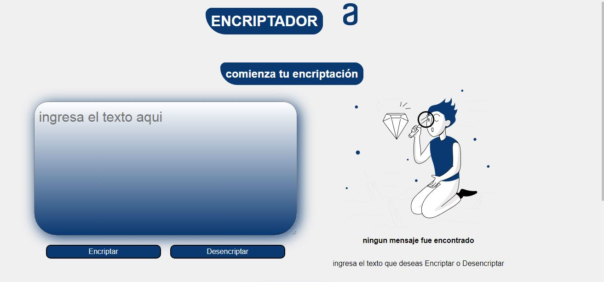

##    (Encriptador de texto-alura Latam),  INGRESA AL LINK DE LA PARTE DE ABAJO PARA OBSERVAR el ENCRIPTADOR
### informacion de uso de aplicacion:

### Introducción al Uso del Sitio Web de Encriptación y Desencriptación de Información

Bienvenido a nuestro sitio web que fue posible gracias a alura Latam; una herramienta confiable y sencilla para encriptar y desencriptar información. Este servicio está diseñado para proteger tus datos y garantizar que solo las personas autorizadas puedan acceder a ellos. A continuación, te explicamos cómo utilizar nuestra plataforma para encriptar y desencriptar texto.

### Condiciones de Uso

Antes de comenzar, ten en cuenta las siguientes condiciones para encriptar el texto:

1. **Solo Letras Minúsculas:** El encriptador funciona únicamente con letras minúsculas. Asegúrate de convertir cualquier letra mayúscula a minúscula antes de ingresar tu texto.
2. **Sin Acentos ni Caracteres Especiales:** No se deben utilizar letras con acentos ni caracteres especiales (como ñ, ç, etc.). El texto debe estar compuesto exclusivamente por letras del alfabeto inglés (a-z).
3. **Conversión Bidireccional:** Nuestro sistema permite tanto la conversión de una palabra a su versión encriptada como la reversión de una palabra encriptada a su versión original.

### Cómo Encriptar Información

1. **Ingresar Texto:** Introduce la palabra o frase que deseas encriptar en el campo de texto proporcionado.
2. **Verificar Requisitos:** Asegúrate de que el texto cumpla con las condiciones mencionadas (solo letras minúsculas, sin acentos ni caracteres especiales).
3. **Encriptar:** Haz clic en el botón de encriptar. El sistema convertirá automáticamente tu texto a su versión encriptada y te mostrará el resultado.

### Cómo Desencriptar Información

1. **Ingresar Texto Encriptado:** Introduce la palabra o frase encriptada en el campo de texto proporcionado.
2. **Desencriptar:** Haz clic en el botón de desencriptar. El sistema revertirá el texto a su versión original y te mostrará el resultado.

### Ejemplo de Uso

- **Texto Original:** gato
- **Texto Encriptado:** gaitober
- **Texto Desencriptado:** gato

___

[ CLICK AQUI PARA VISUALIZAR ](https://portafolio-breinner.vercel.app/index.html)

___

